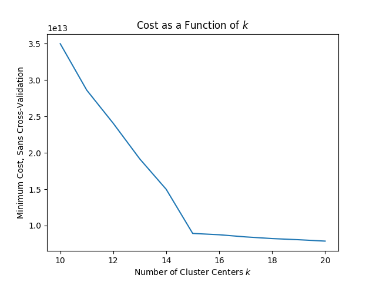
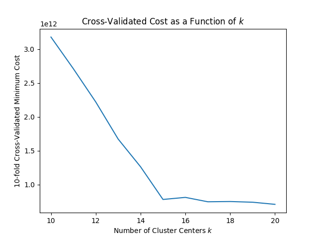

# Disclaimer

This is an extension of code from a workshop hosted by the Pittsburgh Supercomputing Center, which I attended. This repo's purpose is mostly to get familiar with Spark.

I ran this code on the Pittsburgh Supercomputing Center's clusters, so the importing of modules might look a little funny in this code.

# Introduction 

K-means requires that a value of `k` be specified at the start, but I know of no general way to check that the supplied value of `k` is optimal. In my machine learning class, it was suggested that we look for "elbow points" in the curve of cost as a function of `k`, i.e. by eyeballing a graph. That's pretty clear in the graph below, which was produced by `kmeans-sans-crossval.py`:

`kmeans-crossval.py` calculates cost through cross-validation. The hope is that cross-validated cost would be a better metric because it's a calculation of how the fitted clustering, which captures some latent structure, *generalizes* to unseen, independent data. The resulting graph is below:

# Results

As is evident in the plots, there's virtually no difference in the shape of the two curves. Empirically, the two metrics of cost yield insignificantly different results. 

The little increase at k=16 is probably insignificant, most likely the result of too many consecutive, suboptimal initialization.

# Conclusion

In retrospect, this is pretty obvious, and I'm embarassed I didn't see it right away. 

For example, suppose you have data drawn from a handful of Gaussian distributions, each with a different mean. If you place your fitted cluster centers in a dense, rectangular grid that covers the entire domain of the data, and make the grid denser as you increase k, then for any new data, cost would tend to zero as k tends to infinity. This example shows that cross-validated cost and and regular old cost have the same asymptotic behaviour.

If there's anything to take away from this, it's that k-means clustering is really, *really* dumb. Fitting a mixture model might be slower, but it would be more insightful by far, and can even be statistically tested!
